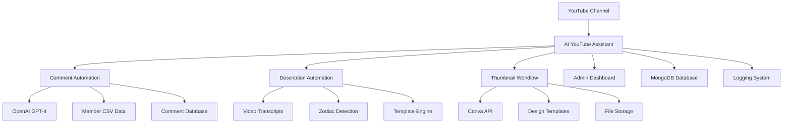

# AI YouTube Assistant - Workflow Documentation

## Overview

This AI YouTube Assistant is a comprehensive automation system designed specifically for tarot/astrology YouTube channels. It provides three main automation workflows that work together to streamline content management, community engagement, and video optimization.

## Automation Workflows

### 🤖 [Comment Automation Workflow](./COMMENT_AUTOMATION.md)
**Intelligent comment processing with AI-powered sentiment analysis**

- **Purpose**: Automatically process YouTube comments using AI to like, reply, or delete based on content and member tier
- **Key Features**: 
  - Sentiment analysis using OpenAI GPT-4
  - Member tier recognition (Tier 1-3 vs. free subscribers)
  - Automatic responses to milestones and praise
  - Troll/spam detection and removal
  - Superfan tracking and scoring
- **Automation**: Runs every hour via cron job
- **APIs Used**: YouTube Data API v3, OpenAI API
- **Database**: MongoDB with Comment, CommentAction, and Member models

### 📝 [Description Automation Workflow](./DESCRIPTION_AUTOMATION.md) 
**Automatic video description updates with timestamps and content**

- **Purpose**: Automatically update video descriptions with standardized content, timestamps, and promotional links
- **Key Features**:
  - Video type detection (weekly forecasts, bonus videos, livestreams)
  - Zodiac sign extraction from titles and transcripts
  - Automatic tarot reading timestamp detection
  - Template-based description generation
  - Pinned comment creation with reading times
- **Automation**: Runs every hour via cron job
- **APIs Used**: YouTube Data API v3
- **Database**: MongoDB with Video and ProcessedVideo models

### 🎨 [Thumbnail Update Workflow](./THUMBNAIL_UPDATE_WORKFLOW.md)
**Custom thumbnail generation and YouTube upload automation**

- **Purpose**: Generate custom thumbnails for all zodiac signs using Canva and upload to YouTube videos
- **Key Features**:
  - Canva API integration for professional thumbnail design
  - Multiple template support
  - Batch generation for all 12 zodiac signs
  - Automatic YouTube thumbnail upload
  - Comprehensive error handling and retry mechanisms
- **Automation**: Manual trigger via admin dashboard
- **APIs Used**: Canva API, YouTube Data API v3

## System Architecture



## Quick Start Guide

### 1. Prerequisites
- Node.js 16+ and npm
- MongoDB database
- YouTube Data API credentials
- OpenAI API key (for comment automation)
- Canva API credentials (for thumbnail workflow)
- SMTP email configuration (for alerts)

### 2. Installation
```bash
# Clone the repository
git clone <repository-url>
cd backend

# Install dependencies
npm install

# Copy and configure environment variables
cp env.example .env
# Edit .env with your API keys and credentials

# Start the application
npm start
```

### 3. Configuration Files
- **Environment Variables**: `env.example` → `.env`
- **Keywords Configuration**: `src/config/keywords.js`
- **Member Data**: `members of channel.csv`
- **Database Connection**: MongoDB URI in `.env`

## Admin Dashboard

Access the admin dashboard at `http://localhost:3000/admin` (requires `ADMIN_API_KEY`)

### Features
- **Real-time Statistics**: Comment processing, video automation, and thumbnail generation metrics
- **Comment Management**: Search, filter, and review automated actions
- **Thumbnail Generator**: Create and upload custom thumbnails for all zodiac signs
- **Member Analytics**: Track superfan scores and engagement patterns
- **Manual Controls**: Override automation decisions when needed

## API Endpoints

### Comment Automation
```http
GET /admin/comments/stats/daily          # Daily comment statistics
GET /admin/comments/search              # Search processed comments
POST /admin/comments/process            # Manual comment processing
```

### Video Automation  
```http
GET /admin/videos/processed             # Get processed video data
POST /admin/videos/process              # Manual video processing
GET /admin/videos/stats                 # Video processing statistics
```

### Thumbnail Workflow
```http
POST /admin/generate-thumbnail          # Generate thumbnails for all signs
POST /admin/update-thumbnails          # Upload thumbnails to videos
GET /admin/thumbnails/status           # Check generation status
```

## Database Models

### Core Models
- **Comment**: Stores comment data, sentiment analysis, and automation actions
- **CommentAction**: Logs all automated actions (replies, deletions, etc.)
- **Member**: Tracks user engagement, tier status, and superfan scores
- **Video**: Tracks which videos have been processed
- **ProcessedVideo**: Stores detailed video processing results
- **ThumbnailUpdate**: Manages thumbnail generation and upload status

### Relationships
```
Channel → Videos → Comments → Actions
       → Members → Superfan Tracking
       → Thumbnails → Upload Status
```

## Monitoring & Analytics

### Real-time Metrics
- Comment processing rate and success/failure counts
- Sentiment analysis distribution (positive/negative/neutral)
- Member tier engagement patterns
- Video processing completion status
- Thumbnail generation and upload success rates

### Daily Reports
- Automated email reports with key statistics
- Sentiment trends and member engagement insights
- Processing errors and recommendations
- Superfan activity and milestone celebrations

### Error Tracking
- Comprehensive logging with Winston
- API error handling and retry mechanisms
- Database operation monitoring
- File system and network error recovery

## Security & Best Practices

### Security Measures
- API keys stored securely in environment variables
- Admin endpoints protected with authentication
- Rate limiting on public endpoints
- Input validation and sanitization
- CORS configuration for frontend access

### Best Practices
- Regular backup of member data and processed content
- Monitor API usage and costs (OpenAI, YouTube quotas)
- Test automation rules in staging before production
- Keep keyword lists updated based on community feedback
- Review automated actions periodically for accuracy

## Troubleshooting

### Common Issues
1. **OpenAI API Errors**: Check API key validity and usage limits
2. **YouTube API Rate Limits**: Implement exponential backoff and retry logic
3. **Database Connection Issues**: Verify MongoDB URI and network connectivity
4. **Canva Authentication**: Refresh OAuth tokens when expired
5. **Missing Transcripts**: Handle gracefully when captions aren't available

### Debug Mode
```bash
NODE_ENV=development npm start
```
Enables detailed logging for all workflows and API interactions.

### Log Files
- Application logs: Winston logger output
- Error tracking: Comprehensive error reporting
- API usage: Request/response logging for debugging

## Contributing

### Development Setup
1. Fork the repository
2. Create feature branch: `git checkout -b feature/new-workflow`
3. Make changes and test thoroughly
4. Update documentation for any new features
5. Submit pull request with detailed description

### Testing
- Unit tests for core automation logic
- Integration tests for API endpoints
- Manual testing scripts for each workflow
- Staging environment for testing automation rules

## Support & Maintenance

### Regular Maintenance Tasks
- Update keyword lists based on community feedback
- Review and adjust automation thresholds
- Monitor API usage and optimize calls
- Backup database and processed content
- Update dependencies and security patches

### Performance Optimization
- Database indexing for efficient queries
- Caching strategies for repeated operations
- Parallel processing where applicable
- Memory management for large video processing

## Future Enhancements

### Planned Features
- **Machine Learning**: Channel-specific sentiment analysis models
- **Advanced Analytics**: Detailed engagement and performance metrics  
- **Multi-Channel Support**: Manage multiple YouTube channels
- **Integration Expansion**: Discord, Twitter, and other platforms
- **Mobile Dashboard**: Mobile-responsive admin interface

### Experimental Features
- **Voice Analysis**: Sentiment detection from audio content
- **Automated Scheduling**: Optimal posting time recommendations
- **Community Insights**: Advanced member behavior analysis
- **Content Optimization**: AI-powered title and description suggestions

## License & Credits

This project is designed for tarot/astrology content creators looking to automate and optimize their YouTube channel management. All automation follows YouTube's Terms of Service and API usage policies.

For questions, support, or feature requests, please refer to the individual workflow documentation or contact the development team. 