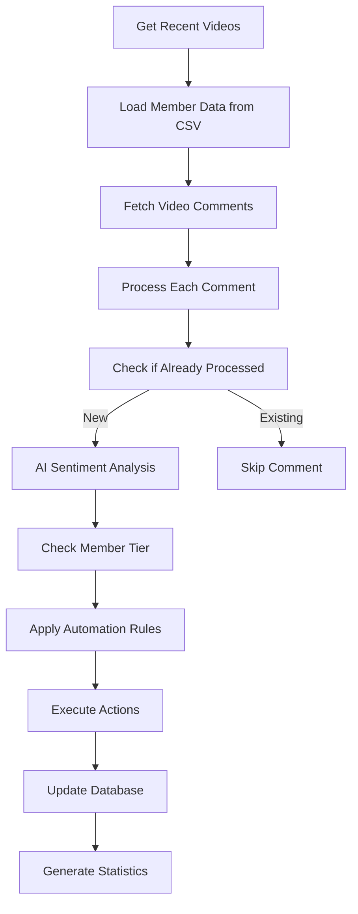

# Comment Automation Workflow

## Overview

The Comment Automation system is an AI-powered workflow that automatically processes YouTube comments for tarot/astrology channels. It analyzes sentiment, detects keywords, and performs automated actions like liking, replying, or deleting comments based on configurable rules and member tier preferences.

## Features

### 🤖 Automated Comment Processing
- **Sentiment Analysis**: Uses OpenAI GPT-4 to analyze comment sentiment (positive, negative, neutral)
- **Keyword Detection**: Identifies milestone, praise, negative, troll, and alert keywords
- **Member Tier Recognition**: Differentiates between free subscribers and paid members (Tier 1-3)
- **Superfan Tracking**: Automatically tracks and scores engaged community members

### 🎯 Smart Automation Actions


#### Auto-Reply Logic
- **Milestone responses**: Automatic congratulations for birthdays, promotions, marriages, etc.
- **Praise responses**: Thanks for positive feedback about readings
- **Special keywords**: Custom responses (e.g., "Ruby" → "🐶🥰❤️")
- **Personalized replies**: Enhanced responses for higher-tier members

#### Deletion Logic
- **Troll content**: Automatically removes comments with troll keywords
- **Toxic behavior**: Deletes harassment, spam, or abusive content
- **Member protection**: More lenient deletion rules for higher-tier members


## Technical Architecture

### Core Components

#### CommentAutomation Class (`src/services/commentAutomation.js`)
- Main orchestrator for comment processing
- Handles video discovery and comment retrieval
- Manages automation rules and member tier logic

#### AI Service (`src/services/aiService.js`)
- OpenAI GPT-4 integration for sentiment analysis
- Toxicity detection and keyword extraction
- Automated reply generation

#### Database Models
- **Comment**: Stores comment data, sentiment, and automation actions
- **CommentAction**: Logs all actions taken (replied, deleted, etc.)
- **Member**: Tracks user engagement and superfan scores

### Workflow Process



## Configuration

### Environment Variables

```bash
# OpenAI Configuration
OPENAI_API_KEY=your_openai_api_key

# YouTube API
YOUTUBE_CHANNEL_ID=your_youtube_channel_id
GOOGLE_APPLICATION_CREDENTIALS=path/to/credentials.json

# Database
MONGODB_URI=mongodb://localhost:27017/youtube-comment-assistant
```

### Keyword Configuration (`src/config/keywords.js`)

#### Milestone Keywords
```javascript
milestones: {
  'my birthday': 'Happy birthday! 🥳🎉',
  'promotion': 'Congrats! 🥳🎉',
  'getting married': 'Congrats! 🥳🎉',
  'new job': 'Congrats on your new job! 🎉',
  'graduation': 'Congratulations on graduating! 🎓✨'
}
```

#### Praise Keywords
```javascript
praise: {
  'you\'re the best': 'Thank you so much! ❤️',
  'love your readings': 'Thank you! So glad you enjoy them! ❤️',
  'spot on': 'Thank you! ❤️'
}
```

#### Negative Keywords (Never Like)
```javascript
negative: [
  'depressed', 'anxious', 'scared', 'death',
  'sick', 'illness', 'died', 'cancer', 'funeral'
]
```

#### Troll Keywords (Auto-Delete)
```javascript
troll: [
  'too long', 'talk too much', 'get to the point',
  'you talk too much', 'finish a sentence'
]
```

## Member Tier System

### Tier Classification
- **Tier 3**: Legendary members ($19.99/month)
- **Tier 2**: Really Good members ($9.99/month)  
- **Tier 1**: Members ($2.99/month)
- **None**: Free subscribers

### Tier-Based Rules

#### Deletion Logic
```javascript
const shouldDelete = memberStatus === 'none' ||
  (memberStatus === 'tier1' && sentiment.confidence > 0.9) ||
  (memberStatus === 'tier2' && sentiment.confidence > 0.95) ||
  (memberStatus === 'tier3' && sentiment.confidence > 0.98);
```

#### Like Logic
- **Tier 1-3**: Like all comments unless negative sentiment
- **Free subscribers**: Only like positive comments that praise the channel

## Superfan Scoring System

### Score Calculation
- **Base points**: Tier 3 (+50), Tier 2 (+30), Tier 1 (+15), Free (+5)
- **Sentiment bonus**: Positive sentiment (+0-20 based on confidence)
- **Keyword bonuses**: Milestone (+10), Praise (+15), Alert keywords (+20)
- **Engagement bonus**: +2 points per like received on comment

### Superfan Status
- **Threshold**: 100+ points
- **Benefits**: Enhanced tracking and potential for special recognition

## Usage & Operation

### Manual Operation

```javascript
const commentAutomation = require('./src/services/commentAutomation');

// Process comments for recent videos
const stats = await commentAutomation.processComments();
console.log('Processing complete:', stats);
```

### Automated Operation (Cron Job)

```javascript
// Runs every hour (configured in src/index.js)
cron.schedule('0 * * * *', async () => {
  logger.info('Starting comment automation cycle');
  await commentAutomation.processComments();
});
```

### API Endpoints

#### Get Daily Statistics
```http
GET /admin/comments/stats/daily
Headers: X-API-Key: your_admin_api_key
```

Response:
```json
{
  "totalComments": 150,
  "totalLiked": 45,
  "totalReplied": 12,
  "totalDeleted": 3,
  "sentimentBreakdown": {
    "positive": 120,
    "negative": 15,
    "neutral": 15
  },
  "memberTierBreakdown": {
    "tier3": 5,
    "tier2": 15,
    "tier1": 30,
    "none": 100
  }
}
```

## Database Schema

### Comment Model
```javascript
{
  commentId: String,
  videoId: String,
  authorChannelId: String,
  authorDisplayName: String,
  textDisplay: String,
  memberStatus: ['none', 'tier1', 'tier2', 'tier3'],
  sentiment: {
    score: Number,
    label: String,
    confidence: Number
  },
  automationActions: [
    {
      action: String,
      timestamp: Date,
      reason: String,
      responseText: String
    }
  ],
  superfanScore: Number,
  isSuperfan: Boolean
}
```

### CommentAction Model
```javascript
{
  videoId: String,
  videoTitle: String,
  commentId: String,
  commentText: String,
  repliedComment: String,
  actionType: ['deleted', 'replied'],
  memberStatus: String,
  reason: String
}
```

## Monitoring & Alerts

### Dashboard Integration
- **Real-time stats**: Live comment processing statistics
- **Search & filter**: Find specific comments and actions
- **Manual actions**: Override automation decisions when needed

## Troubleshooting

### Common Issues

#### OpenAI API Errors
```javascript
// Fallback to basic keyword detection if OpenAI fails
if (!this.openai) {
  logger.warn('OpenAI not configured. Using basic keyword detection.');
  return this.basicKeywordAnalysis(commentText);
}
```

#### Rate Limiting
- **YouTube API**: Built-in request throttling
- **OpenAI API**: Error handling with graceful degradation

#### Database Connection Issues
```javascript
// Retry mechanism for MongoDB operations
try {
  await comment.save();
} catch (error) {
  logger.error('Database save failed:', error);
  // Handle gracefully without stopping automation
}
```

### Debug Mode
Enable detailed logging:
```bash
NODE_ENV=development npm start
```

## Best Practices

### 1. Keyword Management
- Regularly review and update keyword lists
- Monitor false positives and adjust thresholds
- Test new keywords in staging environment

### 2. Member Data Maintenance
- Keep member CSV file updated with current subscribers
- Verify tier assignments match YouTube membership levels
- Backup member data regularly

### 3. Performance Optimization
- Monitor OpenAI API usage and costs
- Implement caching for repeated sentiment analysis
- Use database indexes for efficient comment queries

### 4. Content Moderation
- Regularly review deleted comments for false positives
- Maintain manual override capabilities
- Train AI models with channel-specific examples

## Security Considerations

- **API Keys**: Store securely in environment variables
- **Rate Limiting**: Implement to prevent abuse
- **Data Privacy**: Handle comment data according to privacy policies
- **Access Control**: Restrict admin endpoints with authentication

## Dependencies

- **OpenAI**: Sentiment analysis and reply generation
- **YouTube Data API v3**: Comment retrieval and actions
- **MongoDB**: Data storage and analytics
- **Node.js Libraries**: Express, Mongoose, Cron, Nodemailer

## Future Enhancements

- Machine learning model for channel-specific sentiment analysis
- Advanced superfan rewards and recognition system
- Integration with Discord/other community platforms
- Real-time comment moderation dashboard
- Automated response personalization based on user history 