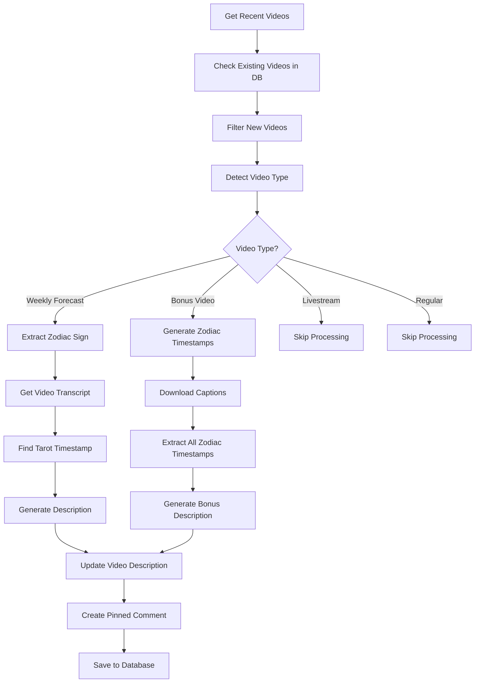

# Description Automation Workflow

## Overview

The Description Automation system automatically processes YouTube videos and updates their descriptions with standardized content, timestamps, and promotional links. It handles different video types (weekly forecasts, bonus videos, livestreams) and intelligently extracts zodiac signs and tarot reading timestamps from video transcripts.

## Features

### 🎯 Automated Video Processing
- **Video Type Detection**: Automatically identifies weekly forecasts, bonus videos, livestreams, and regular content
- **Zodiac Sign Extraction**: Detects which zodiac sign a video targets from titles and transcripts
- **Timestamp Generation**: Automatically finds tarot reading start times in forecasts
- **Description Updates**: Applies standardized descriptions with proper formatting and links

### 📝 Content Management
- **Template-Based Descriptions**: Uses pre-defined templates for different video types
- **Dynamic Content Insertion**: Automatically inserts relevant timestamps, dates, and zodiac information
- **Link Management**: Maintains consistent promotional and affiliate links across all content
- **SEO Optimization**: Includes proper keywords and structured content for discovery

### 🔄 Smart Processing
- **Transcript Analysis**: Processes video captions to extract meaningful timestamps
- **Duplicate Prevention**: Tracks processed videos to avoid redundant updates
- **Error Handling**: Graceful handling of processing failures with detailed logging

## Technical Architecture

### Core Components

#### VideoAutomation Class (`src/services/videoAutomation.js`)
- Main orchestrator for video processing workflow
- Handles video discovery, type detection, and content processing
- Manages database operations and API interactions

#### YouTube Service Integration
- Video metadata retrieval and updates
- Transcript/caption downloading and processing
- Description updates and comment posting

#### Database Models
- **Video**: Tracks which videos have been processed
- **ProcessedVideo**: Stores detailed processing results and metadata

### Video Type Detection Logic

```javascript
detectVideoType(title, description, tags, liveBroadcastContent) {
  // Bonus video detection
  const bonusTier3Keywords = [
    'bonus', 'extended reading', 'all 12 signs', 
    'really good & legendary members'
  ];
  
  // Weekly forecast detection
  const zodiacSigns = [
    'aries', 'taurus', 'gemini', 'cancer', 'leo', 'virgo',
    'libra', 'scorpio', 'sagittarius', 'capricorn', 'aquarius', 'pisces'
  ];
  
  // Livestream detection
  if (liveBroadcastContent === 'live' || liveBroadcastContent === 'upcoming') {
    return 'livestream';
  }
  
  return 'regular';
}
```

## Workflow Process



## Video Type Processing

### 1. Weekly Forecast Videos

#### Detection Criteria
- Title starts with zodiac sign (e.g., "Aries - Weekly Forecast")
- Contains individual zodiac reading content
- Has transcript available for analysis

#### Processing Steps
1. **Extract zodiac sign** from title
2. **Download transcript** via YouTube API
3. **Find tarot transition** using keyword detection
4. **Generate description** with personalized content
5. **Create pinned comment** with reading timestamp

#### Tarot Transition Detection
```javascript
const tarotMarkers = [
  "let's get started",
  "let's really get started", 
  "let's begin your tarot",
  "let's dive in",
  "let's see what's going on for you",
  "i'm going to pull some cards",
  "traditional celtic cross spread",
  "now we're in your tarot reading"
];
```

### 2. Bonus Videos (Extended Readings)

#### Detection Criteria
- Title contains "bonus", "extended reading", "all 12 signs"
- Mentions "really good & legendary members"
- Typically longer format with all zodiac signs

#### Processing Steps
1. **Download SRT captions** for accurate timestamps
2. **Extract zodiac timestamps** using greeting detection
3. **Generate comprehensive description** with all timestamps
4. **Format zodiac-specific links** for easy navigation

#### Zodiac Timestamp Extraction
```javascript
// Detects patterns like "Hi Aries", "Hello Taurus"
const GREETINGS = ['hi', 'hello'];
const pattern1 = new RegExp(`\\b(${GREETINGS.join('|')})\\s+${signLower}\\b`);

// Also handles greeting in one cue, sign in next cue
if (pattern2.test(current) && pattern3.test(next)) {
  const timestamp = this.formatTimeToHHMMSS(cues[i].startTime);
  result[sign] = timestamp;
}
```

### 3. Livestreams

#### Detection Criteria
- `liveBroadcastContent` is 'live' or 'upcoming'
- Tags contain 'live' or 'stream'
- Description mentions livestream

#### Processing
- Currently skipped in automation
- Manual processing recommended for live content

## Description Templates

### Weekly Forecast Template
```javascript
const firstParagraph = `${zodiac}, I begin your forecast with a detailed astrology overview tailored to your sign, which adds more depth, insight and guidance, then your tarot reading: ${timestamp}. I'm proud to be the only astrologer, tarot reader, channeler/clairvoyant to merge these modalities so that you feel you're receiving a very personalized reading. Check your tarot horoscope for love, career, spiritual growth and more ❤️ 

${dateRange} Extended Bonus Readings (All Signs) Really Good & Legendary - https://youtu.be/${bonusId}`;
```

### Bonus Video Template
```javascript
const description = videoTitle + '\n' + '\n' + zodiacTimeStamps + '\n' + '\n' + 
`Donations greatly appreciated!
Paypal: https://www.paypal.com/donate/?hosted_button_id=QFALLQ7DZ27B4
Venmo: https://www.venmo.com/u/thetarotship

Thank you so much for being a member! All your support helps me continue to make weekly videos. Thank you! ❤️

[... additional promotional content ...]`;
```

## Configuration

### Environment Variables
```bash
# YouTube API Configuration
GOOGLE_APPLICATION_CREDENTIALS=path/to/credentials.json
YOUTUBE_CHANNEL_ID=your_youtube_channel_id

# Database
MONGODB_URI=mongodb://localhost:27017/youtube-comment-assistant
```

### Processing Schedule
```javascript
// Runs every hour (configured in src/index.js)
cron.schedule('0 * * * *', async () => {
  logger.info('Starting video automation cycle');
  await videoAutomation.processVideos();
});
```

## Database Schema

### Video Model
```javascript
const videoSchema = new mongoose.Schema({
  videoId: {
    type: String,
    required: true,
    unique: true,
    index: true
  },
  createdAt: {
    type: Date,
    default: Date.now
  }
});
```

### ProcessedVideo Model
```javascript
const processedVideoSchema = new mongoose.Schema({
  videoId: String,
  videoTitle: String,
  videoType: ['bonus_video', 'weekly_forecast', 'livestream', 'regular'],
  finalDescription: String,
  zodiacSign: String,
  timestamps: String,
  weekRange: String,
  pinnedComment: String,
  createdAt: Date,
  updatedAt: Date
});
```

## API Integration

### YouTube Data API v3

#### Get Video Information
```javascript
const videoInfo = await youtubeService.getVideoInfo(videoId);
const videoDescription = videoInfo?.snippet?.description || '';
const videoTags = videoInfo?.snippet?.tags || [];
```

#### Update Video Description
```javascript
await youtubeService.updateVideoDescription(videoId, finalDescription);
```

#### Download Captions
```javascript
await youtubeService.downloadCaptions(videoId);
const srtFileName = `captions-${videoId}.srt`;
```

#### Create Pinned Comment
```javascript
const pinnedComment = `${zodiac}, Your tarot reading starts at ${timestamp}, though I discuss what is happening astrologically for all ${zodiac} in the intro.`;
await youtubeService.addTopLevelComment(videoId, pinnedComment);
```

## Transcript Processing

### SRT Caption Parsing
```javascript
const parser = require('subtitles-parser');
const srt = fsSync.readFileSync(fullPath, 'utf-8');
const cues = parser.fromSrt(srt);

// Process each cue for zodiac sign detection
for (let i = 0; i < cues.length; i++) {
  const current = this.normalize(cues[i].text);
  const next = i + 1 < cues.length ? this.normalize(cues[i + 1].text) : '';
  
  // Pattern matching for "Hi [ZodiacSign]"
  const pattern1 = new RegExp(`\\b(${GREETINGS.join('|')})\\s+${signLower}\\b`);
  if (pattern1.test(current)) {
    const timestamp = this.formatTimeToHHMMSS(cues[i].startTime);
    result[sign] = timestamp;
  }
}
```

### JSON Transcript Analysis
```javascript
// Find tarot transition markers in transcript
const tarotMarkers = [
  "let's get started",
  "let's really get started",
  "let's begin your tarot",
  "let's dive in"
];

for (let i = 0; i < segments.length - 1; i++) {
  const combinedText = (current.text + ' ' + next.text).toLowerCase();
  
  for (const marker of tarotMarkers) {
    if (combinedText.includes(marker)) {
      return {
        transitionText: current.text + ' ' + next.text,
        timestamp: current.timestamp,
        startTime: parseInt(current.startTimeMs) / 1000
      };
    }
  }
}
```

## Usage Examples

### Manual Processing
```javascript
const videoAutomation = require('./src/services/videoAutomation');

// Process all recent videos
const stats = await videoAutomation.processVideos();
console.log('Processing complete:', stats);

// Process specific video
await videoAutomation.processVideoTimestampsAndDescription(
  'videoId123', 
  'Aries Weekly Forecast', 
  'bonusVideoId456'
);
```

### Get Processing Status
```javascript
// Check if video has been processed
const existingVideo = await Video.findOne({ videoId: 'videoId123' });
const isProcessed = !!existingVideo;

// Get detailed processing data
const processedData = await ProcessedVideo.findOne({ videoId: 'videoId123' });
console.log('Processed details:', processedData);
```

## Error Handling

### Common Scenarios

#### Missing Transcript
```javascript
try {
  const transcript = await youtubeService.getTranscript(videoId);
} catch (error) {
  logger.warn(`No transcript available for video ${videoId}`);
  // Skip transcript-dependent processing
}
```

#### Caption Download Failure
```javascript
try {
  await youtubeService.downloadCaptions(videoId);
} catch (error) {
  logger.error(`Failed to download captions for ${videoId}:`, error);
  // Continue with available data
}
```

#### API Rate Limiting
```javascript
// Built-in retry mechanism with exponential backoff
try {
  await youtubeService.updateVideoDescription(videoId, description);
} catch (error) {
  if (error.code === 403) {
    logger.warn('Rate limit reached, will retry next cycle');
    return;
  }
  throw error;
}
```

## Content Templates

### Standard Links Section
```markdown
Donations greatly appreciated!
Paypal: https://www.paypal.com/donate/?hosted_button_id=QFALLQ7DZ27B4
Venmo: https://www.venmo.com/u/thetarotship

MY FAVORITE THINGS!

My Favorite Earthing Mat (Grounding Inside Your Home)
https://bit.ly/3QFArUP

Your Sixth Sense - Belleruth Naparstek
https://amzn.to/4bsSFCk

Clear Crystal Quartz! 
https://amzn.to/3QLSFDU

[... additional affiliate links ...]
```

### Legal Disclaimer
```markdown
LEGAL DISCLAIMER:
My tarot readings are for entertainment purposes only. I am an intuitive consultant using my knowledge of astrology, tarot, intuition and divination. I am not a medical professional, and I cannot give legal, financial, or medical advice. Viewers are responsible for how they view the videos, and their interpretations.
```

## Performance Optimization

### Video Processing Efficiency
- **Parallel Processing**: Process multiple videos concurrently when possible
- **Caching**: Store processed transcript data to avoid reprocessing
- **Selective Updates**: Only update videos that actually need changes

### API Usage Optimization
- **Batch Operations**: Group YouTube API calls when possible
- **Rate Limiting**: Respect API quotas and implement backoff strategies
- **Error Recovery**: Graceful handling of temporary API failures

## Monitoring & Analytics

### Processing Statistics
```javascript
const stats = {
  videosProcessed: 0,
  descriptionsUpdated: 0,
  commentsCreated: 0,
  errors: 0,
  skipped: 0
};
```

### Database Queries
```javascript
// Get processing summary
const summary = await ProcessedVideo.aggregate([
  {
    $group: {
      _id: '$videoType',
      count: { $sum: 1 },
      avgProcessingTime: { $avg: '$processingTimeMs' }
    }
  }
]);
```

## Best Practices

### 1. Content Quality
- Review auto-generated descriptions before publishing
- Ensure timestamp accuracy through manual verification
- Maintain consistent branding and messaging

### 2. SEO Optimization
- Include relevant keywords in descriptions
- Use structured formatting for better readability
- Maintain consistent link placement and formatting

### 3. Error Prevention
- Validate video data before processing
- Implement comprehensive logging for debugging
- Test processing logic with sample videos

### 4. Maintenance
- Regular backup of processed video data
- Monitor API usage and costs
- Update templates based on content strategy changes

## Future Enhancements

- **AI-Powered Descriptions**: Use GPT to generate personalized descriptions
- **Automatic SEO Optimization**: Dynamic keyword insertion based on trends
- **Multi-Language Support**: Automated translation for international audiences
- **Advanced Analytics**: Detailed performance metrics for processed content
- **Batch Processing UI**: Admin interface for manual processing control 