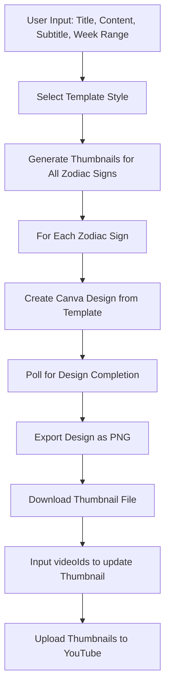

# Thumbnail Update Workflow

## Overview

The Thumbnail Update Workflow is an automated system that generates custom thumbnails for YouTube videos using the Canva API and automatically uploads them to YouTube. It supports multiple template styles, zodiac-specific content generation, and batch processing for all 12 zodiac signs with comprehensive error handling and retry mechanisms.

## Features

### 🎨 Automated Thumbnail Generation
- **Canva API Integration**: Uses Canva's design automation to create professional thumbnails
- **Multiple Templates**: Supports 4 different thumbnail styles/templates
- **Zodiac-Specific Content**: Automatically generates thumbnails for all 12 zodiac signs
- **Dynamic Text Insertion**: Customizes title, content, subtitle, and week range per design

### 📤 YouTube Upload Integration
- **Automatic Upload**: Seamlessly uploads generated thumbnails to YouTube videos
- **Batch Processing**: Updates multiple videos simultaneously
- **File Management**: Organized storage and cleanup of thumbnail files
- **Status Tracking**: Monitors upload success/failure for each video

### 🔄 Robust Error Handling
- **Retry Mechanism**: Automatic retries with exponential backoff
- **Partial Success**: Continues processing even if some thumbnails fail
- **Detailed Logging**: Comprehensive error reporting and debugging information
- **Rate Limit Management**: Handles API rate limits gracefully

## Technical Architecture

### Core Components

#### Admin Dashboard (`src/routes/admin.js`)
- **Thumbnail Generation Endpoint**: `/admin/generate-thumbnail`
- **Thumbnail Update Endpoint**: `/admin/update-thumbnails`
- **Web Interface**: HTML form for easy thumbnail management

#### Canva Service (`src/services/canvaService.js`)
- **OAuth Authentication**: Manages Canva API access tokens
- **Design Creation**: Creates designs from templates with custom data
- **Export Management**: Handles design export and download processes

#### YouTube Service (`src/services/youtubeService.js`)
- **Thumbnail Upload**: Direct thumbnail upload to YouTube videos
- **File Validation**: Ensures thumbnail meets YouTube requirements
- **Error Handling**: Comprehensive API error management

## Workflow Process



## Configuration

### Environment Variables

```bash
# Canva API Configuration
CANVA_CLIENT_ID=your_canva_client_id
CANVA_CLIENT_SECRET=your_canva_client_secret
CANVA_REDIRECT_URI=http://127.0.0.1:3001/oauth/redirect
CANVA_REFRESH_TOKEN=your_canva_refresh_token

# YouTube API Configuration  
GOOGLE_APPLICATION_CREDENTIALS=path/to/google-credentials.json
YOUTUBE_CHANNEL_ID=your_youtube_channel_id

# Admin Access
ADMIN_API_KEY=your_secure_admin_api_key
```

### Template Configuration

```javascript
// Template IDs for different styles
const templateIds = [
  'EAGtUY5UqvY', // Template 1
  'EAGteElF23I', // Template 2
  'EAGteEpJf-k', // Template 3
  'EAGteTqYqwc'  // Template 4
];

// Zodiac signs processing order
const orderedSigns = [
  'ARIES', 'TAURUS', 'GEMINI', 'CANCER', 'LEO', 'VIRGO',
  'LIBRA', 'SCORPIO', 'SAGITTARIUS', 'CAPRICORN', 'AQUARIUS', 'PISCES'
];
```

## API Endpoints

### Generate Thumbnails

```http
POST /admin/generate-thumbnail
Content-Type: application/json
X-API-Key: your_admin_api_key

{
  "title": "*SPECIAL EXTENDED READING",
  "content": "PREPARE FOR FORTUNATE SHIFT", 
  "subtitle": "+ Turbocharged New \"Super\" Moon Activates",
  "weekRange": "JULY 21-31",
  "thumbnailStyle": "template1"
}
```

**Response:**
```json
{
  "success": true,
  "message": "Thumbnail generation completed. 12 successful, 0 failed.",
  "results": [
    {
      "sign": "ARIES",
      "status": "success",
      "filePath": "./src/views/thumbnails/thumbnail-aries.png",
      "downloadUrl": "https://canva-download-url.com/...",
      "attempts": 1
    }
  ],
  "generatedCount": 12,
  "failedCount": 0
}
```

### Update Video Thumbnails

```http
POST /admin/update-thumbnails
Content-Type: application/json
X-API-Key: your_admin_api_key

{
  "videoUpdates": {
    "videoId123": {
      "zodiacSign": "ARIES",
      "thumbnailPath": "/views/thumbnails/thumbnail-aries.png"
    },
    "videoId456": {
      "zodiacSign": "TAURUS", 
      "thumbnailPath": "/views/thumbnails/thumbnail-taurus.png"
    }
  }
}
```

**Response:**
```json
{
  "success": true,
  "message": "Thumbnail update completed. 2 successful, 0 failed.",
  "results": [
    {
      "videoId": "videoId123",
      "zodiacSign": "ARIES", 
      "status": "success",
      "thumbnailPath": "./src/views/thumbnails/thumbnail-aries.png"
    }
  ],
  "successCount": 2,
  "failedCount": 0,
  "totalRequested": 2
}
```

## Canva Integration

### Design Creation Process

```javascript
// 1. Create design from template
const autofillJob = await canvaService.createDesignFromTemplate(
  validToken, 
  templateId, 
  zodiacSign, 
  weekRange, 
  title, 
  content, 
  subtitle
);

// 2. Poll for completion
const jobData = await canvaService.getDesignFromAutofillJobId(
  validToken, 
  autofillJob.id
);

// 3. Export design
const exportRes = await canvaService.createDesignExportJob(
  validToken, 
  jobData.result.design.id
);

// 4. Download exported file
const designData = await canvaService.getDesignExportFromJobId(
  validToken, 
  exportRes.id
);
```

### Template Data Mapping

```javascript
// Dynamic text replacement in Canva templates
const templateData = {
  zodiacSign: zodiacSign,     // Main zodiac sign text
  weekRange: weekRange,       // Date range (e.g., "JULY 21-31")
  title: title,              // Main title text
  content: content,          // Content/description
  subtitle: subtitle         // Additional subtitle text
};
```

### Error Handling & Retries

```javascript
const maxRetries = 3;
const maxPollAttempts = 10;

// Retry mechanism with exponential backoff
while (retryCount <= maxRetries) {
  try {
    // Design creation and export logic
    break; // Success - exit retry loop
  } catch (error) {
    retryCount++;
    if (retryCount <= maxRetries) {
      const waitTime = 2000 * retryCount; // Exponential backoff
      await delay(waitTime);
    }
  }
}
```

## YouTube Upload Process

### File Validation

```javascript
// Check file exists and size requirements
if (!fs.existsSync(thumbnailPath)) {
  throw new Error(`Thumbnail file not found: ${thumbnailPath}`);
}

const stats = fs.statSync(thumbnailPath);
const fileSizeInMB = stats.size / (1024 * 1024);

if (fileSizeInMB > 2) {
  throw new Error(`File too large: ${fileSizeInMB.toFixed(2)}MB (max 2MB)`);
}
```

### Upload Implementation

```javascript
// Direct HTTP upload to YouTube API
const imageBuffer = fs.readFileSync(thumbnailPath);

const response = await axios.post(
  'https://www.googleapis.com/upload/youtube/v3/thumbnails/set',
  imageBuffer,
  {
    params: { videoId, uploadType: 'media' },
    headers: {
      'Authorization': `Bearer ${accessToken}`,
      'Content-Type': contentType,
      'Content-Length': imageBuffer.length
    }
  }
);
```

### Error Handling

```javascript
// Specific YouTube API error handling
if (status === 403) {
  errorMessage = 'Permission denied. Check video ownership and permissions.';
} else if (status === 404) {
  errorMessage = 'Video not found. Check video ID.';
} else if (status === 400) {
  errorMessage = 'Invalid request. Check file format (JPG, GIF, BMP, PNG).';
} else if (status === 401) {
  errorMessage = 'Authentication failed. Re-authenticate YouTube account.';
}
```

## Web Interface

### Dashboard UI Components

#### Thumbnail Generation Form
```html
<form id="thumbnailForm">
  <input type="text" id="title" placeholder="Enter Title" required>
  <input type="text" id="content" placeholder="Enter Content" required>
  <input type="text" id="subtitle" placeholder="Enter Subtitle" required>
  <input type="text" id="weekRange" placeholder="Enter Week Range" required>
  <select id="thumbnailStyle">
    <option value="template1">Template 1</option>
    <option value="template2">Template 2</option>
    <option value="template3">Template 3</option>
    <option value="template4">Template 4</option>
  </select>
  <button type="submit">Generate Thumbnails</button>
</form>
```

#### Results Display
```javascript
// Show thumbnail results with preview images
function showThumbnailResults(response) {
  response.results.forEach(result => {
    const thumbnailUrl = `/views/thumbnails/thumbnail-${result.sign.toLowerCase()}.png`;
    resultsHtml += `
      <div class="thumbnail-card">
        
        <h6>${result.sign}</h6>
        <input type="text" class="video-id-input" data-sign="${result.sign.toLowerCase()}" 
               placeholder="Enter Video ID">
      </div>
    `;
  });
}
```

#### Video Mapping Interface
```javascript
// Collect video IDs for thumbnail updates
function getAllVideoIds() {
  const videoIds = {};
  $('.video-id-input').each(function() {
    const sign = $(this).data('sign');
    const videoId = $(this).val().trim();
    if (videoId) {
      videoIds[sign] = videoId;
    }
  });
  return videoIds;
}
```

## File Management

### Directory Structure
```
src/views/
├── thumbnails/
│   ├── thumbnail-aries.png
│   ├── thumbnail-taurus.png
│   ├── thumbnail-gemini.png
│   └── ... (all zodiac signs)
└── assets/
    ├── template1.jpg
    ├── template2.jpg
    ├── template3.jpg
    └── template4.jpg
```

### File Operations
```javascript
// Ensure thumbnails directory exists
const thumbnailsDir = path.dirname(outputPath);
if (!fs.existsSync(thumbnailsDir)) {
  fs.mkdirSync(thumbnailsDir, { recursive: true });
}

// Stream download to file
const writer = fs.createWriteStream(outputPath);
imgRes.data.pipe(writer);

await new Promise((resolve, reject) => {
  writer.on('finish', resolve);
  writer.on('error', reject);
});
```

## Performance Optimization

### Parallel Processing
```javascript
// Process multiple zodiac signs concurrently
const promises = orderedSigns.map(sign => 
  generateThumbnailForSign(sign, templateId, options)
);

const results = await Promise.allSettled(promises);
```

### Rate Limiting
```javascript
// Delay between API calls to avoid rate limits
const delay = (ms) => new Promise(resolve => setTimeout(resolve, ms));

// Process each sign with delay
for (const sign of orderedSigns) {
  await generateThumbnailForSign(sign);
  await delay(1000); // 1 second between signs
}
```

### Caching Strategy
```javascript
// Cache valid access tokens
let cachedToken = null;
let tokenExpiry = null;

async function ensureValidAccessToken() {
  if (cachedToken && Date.now() < tokenExpiry) {
    return cachedToken;
  }
  
  // Refresh token if expired
  cachedToken = await refreshAccessToken();
  tokenExpiry = Date.now() + (3600 * 1000); // 1 hour
  return cachedToken;
}
```

## Testing & Validation

### Manual Testing Script
```javascript
// test-thumbnail-generation.js
const canvaService = require('./src/services/canvaService');

async function generateTestThumbnail(sign) {
  const templateId = 'EAGtUY5UqvY';
  const weekRange = "JULY 21-31";
  const title = "*SPECIAL EXTENDED READING";
  const content = "PREPARE FOR FORTUNATE SHIFT";
  const subtitle = "+ Turbocharged New \"Super\" Moon Activates";
  
  await generateThumbnailForSign(sign, templateId, {
    weekRange, title, content, subtitle
  });
}
```

### Validation Checks
```javascript
// Validate generated thumbnails
function validateThumbnail(filePath) {
  if (!fs.existsSync(filePath)) {
    throw new Error('Thumbnail file not created');
  }
  
  const stats = fs.statSync(filePath);
  if (stats.size === 0) {
    throw new Error('Thumbnail file is empty');
  }
  
  if (stats.size > 2 * 1024 * 1024) {
    throw new Error('Thumbnail file too large for YouTube');
  }
}
```

## Monitoring & Analytics

### Success Metrics
```javascript
const metrics = {
  totalThumbnailsGenerated: 0,
  successfulUploads: 0,
  failedGenerations: 0,
  failedUploads: 0,
  avgProcessingTime: 0,
  retryCount: 0
};
```

### Error Tracking
```javascript
// Log detailed error information
logger.error('Thumbnail generation failed:', {
  zodiacSign: sign,
  templateId: templateId,
  error: error.message,
  attempt: retryCount + 1,
  timestamp: new Date().toISOString()
});
```

### Performance Monitoring
```javascript
// Track processing times
const startTime = Date.now();
await generateThumbnailForSign(sign);
const processingTime = Date.now() - startTime;

await ThumbnailUpdate.updateOne(
  { videoId },
  { 
    'automationStats.processingTimeMs': processingTime,
    'automationStats.canvaApiCalls': apiCallCount 
  }
);
```

## Troubleshooting

### Common Issues

#### Canva API Authentication
```javascript
// Check token validity
if (!this.initialized) {
  throw new Error('Canva service not properly initialized. Check environment variables.');
}

// Refresh expired tokens
if (response.status === 401) {
  logger.warn('Canva token expired, refreshing...');
  await this.refreshAccessToken();
}
```

#### File System Issues
```javascript
// Handle file permission errors
try {
  fs.writeFileSync(outputPath, data);
} catch (error) {
  if (error.code === 'EACCES') {
    logger.error('Permission denied writing thumbnail file');
  } else if (error.code === 'ENOSPC') {
    logger.error('No space left on device');
  }
  throw error;
}
```

#### YouTube Upload Failures
```javascript
// Retry failed uploads
if (error.response?.status === 500) {
  logger.warn('YouTube server error, retrying upload...');
  await delay(5000);
  return this.retryUpload(videoId, thumbnailPath);
}
```

### Debug Mode
```javascript
// Enable detailed logging
if (process.env.NODE_ENV === 'development') {
  console.log('Template data:', templateData);
  console.log('API response:', response.data);
  console.log('File path:', outputPath);
}
```

## Best Practices

### 1. Template Management
- Keep template IDs organized and documented
- Test templates with sample data before production use
- Version control template configurations

### 2. File Organization
- Use consistent naming conventions for thumbnails
- Implement cleanup routines for old thumbnail files
- Backup successful thumbnail files

### 3. Error Recovery
- Implement comprehensive retry mechanisms
- Log all errors for debugging
- Provide graceful degradation for partial failures

### 4. Performance
- Use parallel processing where possible
- Implement proper rate limiting
- Cache authentication tokens

### 5. User Experience
- Provide real-time progress updates
- Show clear error messages
- Enable bulk operations for efficiency

## Security Considerations

- **API Key Protection**: Store Canva and YouTube credentials securely
- **File Access Control**: Restrict thumbnail file access to authorized users
- **Input Validation**: Sanitize all user inputs for template data
- **Rate Limiting**: Prevent abuse of thumbnail generation endpoints

## Future Enhancements

- **Template Customization**: Allow dynamic template selection per zodiac sign
- **Automated Video Detection**: Auto-map generated thumbnails to matching videos
- **Batch Scheduling**: Schedule thumbnail updates for optimal timing
- **Analytics Integration**: Track thumbnail performance metrics
- **AI-Powered Optimization**: Use ML to optimize thumbnail designs for engagement 